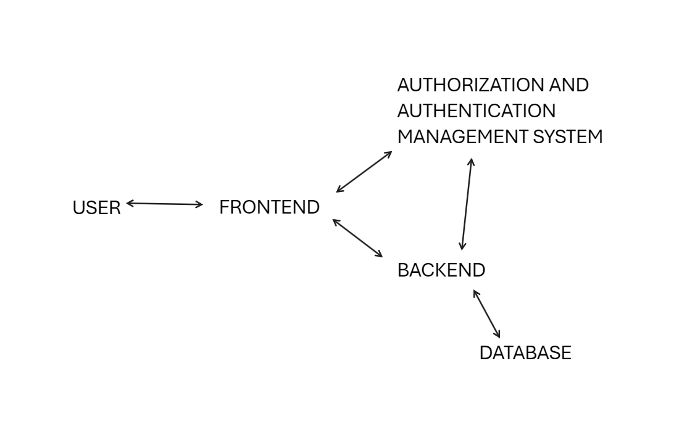

# APP STRUCTURE

App consists of 4 services that are essential for it to work correctly.

These services are:

- backend (tasks rest api)

- frontend

- authorization and authentication management system (keycloak)

- database (mongodb)

# COMMUNICATION BEETWEN SERVICES

When user enters the app he is interacting with frontend service. If user wants to see his tasks he has to log in and it is possible because frontend is talking to keycloak service. After user has succesfully logged in, his tasks are viewed. This is possible because frontend also talks to backend service (rest api). Tasks need to be stored somewhere, so we choose mongodb database for that task.

Whenever user perform operations on tasks through ui frontend talks to backend and backend talks to database.

# SERVICES

## BACKEND

Backend is Node js rest api, that for now utilizes http protocol (we will switch to https in future). It uses Node js version 21.

### REST API

All request below must include access token in `Authorization` header in format:
`Authorization: "Bearer <token>"`.

- get all tasks: GET /tasks
- get one task: GET /tasks/:id
- add task: POST /tasks
- edit task: PATCH /tasks/:id
- delete task: DELETE /tasks/:id
- delete all tasks DELETE /tasks
<!---->

## FRONTEND

Frontend is written in js library ReactJS. It talks to IAM and backend in order to obtain access token and tasks.

## KEYCLOAK

Realm for app is called `demo` and it contains everything that app needs. There are 2 clients:

- backend
- frontend

`backend` client does not initiate login flow on its own it is there just to verify bearer token. `backend` client represents backend service.
`frontend` client initiates `authorization code flow` in the browser, when user wants to login. `frontend` client represents frontend service.

## MONGODB

Free tier cluster with 512mb of storage.
